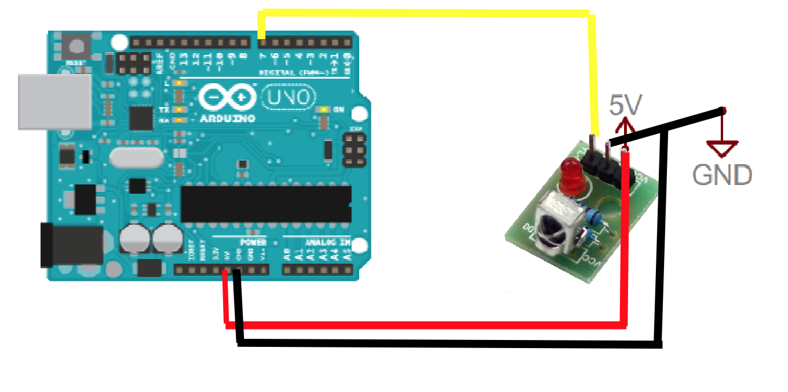
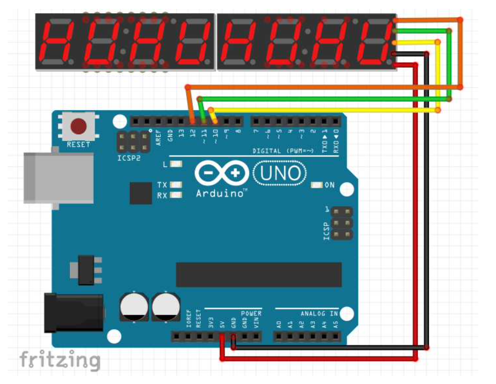
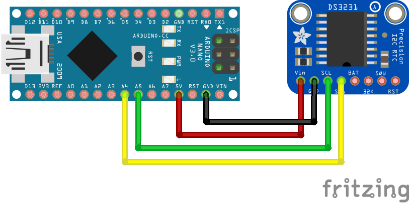
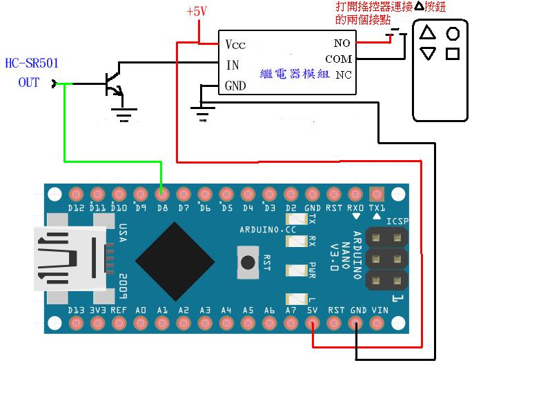

# ArduinoTutorial

這一系列主要用Arduino nano做一個自動鬧鐘開門系統

# 自動鬧鐘鐵捲門開門系統

## 1-輸入篇
   如何使用紅外線遙控器當作鍵盤使用，這裡我用自己家裡的遙控器，你必須換成自己家用的，最好帶有數字鍵盤的紅外線遙控器。

## 2-輸出篇
   如何使用客製化的Printf  移植 C printf 函數
   利用移植 C printf 輸出到 MX7219 八位數碼管

## 3-RTC3231
   本系統利用 RTC3231 做為時鐘

## 4-繼電器控制
   控制繼電器((Relay)

## 5-Timer計時中斷篇
   這個部分目前沒有說明，有個Arduino nano完成所有整合加上使用者介面的應用範例。
提供下列功能：
1. 設定時間
2. 設定鬧鐘時間
3. 直接控制Relay 啟動

原理就把前面學習的全部用上，也順便提供給各位自行發揮。
   整合1~4並寫一個由紅外線遙控器控制的UI流程
   可以設定時間
   設定鬧鐘開門

